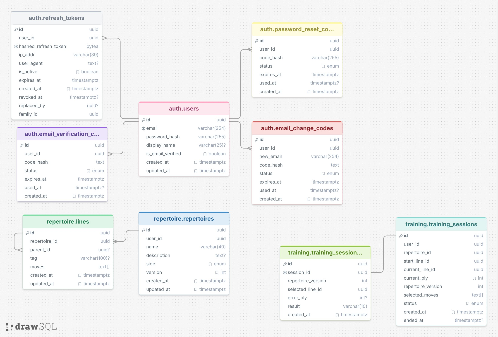

[← README](../README.md)

# Database Schema

Проект использует реляционную базу данных PostgreSQL.

## Entity Relationship Diagram

В production-архитектуре PostgreSQL разделён на **три отдельные базы данных**, каждая из которых принадлежит отдельному микросервису:

* **`auth_db`** — база данных `Auth Service`, отвечающая за пользователей, аутентификацию, refresh-токены и операции с email и паролем.
* **`repertoire_db`** — база данных `Repertoire Service`, отвечающая за шахматные репертуары и их линии.
* **`training_db`** — база данных `Training Service`, отвечающая за тренировочные сессии и их аналитику.

Базы данных являются независимыми. Связи между сущностями разных сервисов не являются PostgreSQL Foreign Keys.

## Auth Service — `auth_db`

### `users`

Основная таблица пользователей системы.

| Поле                | Тип            | Описание                                              |
| ------------------- | -------------- | ----------------------------------------------------- |
| `id`                | `uuid`         | Уникальный идентификатор пользователя.                |
| `email`             | `varchar(254)` | Email пользователя.                                   |
| `password_hash`     | `varchar(255)` | Хэш пароля, созданный с использованием Argon2id.      |
| `display_name`      | `varchar(25)`  | Отображаемое имя пользователя.                        |
| `gender`            | `varchar(1)`   | Пол пользователя: `M` или `F`.                        |
| `country`           | `varchar(2)`   | Код страны пользователя в формате ISO 3166-1 alpha-2. |
| `birth_date`        | `date`         | Дата рождения пользователя.                           |
| `bio`               | `varchar(75)`  | Краткая информация о пользователе.                    |
| `telegram_alias`    | `varchar(32)`  | Username пользователя в Telegram без `@`.             |
| `is_email_verified` | `boolean`      | Показывает, подтверждён ли email пользователя.        |
| `created_at`        | `timestamptz`  | Дата и время создания пользователя.                   |
| `updated_at`        | `timestamptz`  | Дата и время последнего изменения пользователя.       |

### `refresh_tokens`

Хранит refresh-токены пользователей и информацию об их жизненном цикле. Сам refresh-токен в базе не хранится, вместо этого сохраняется его хэш.

| Поле                   | Тип           | Описание                                                                                        |
| ---------------------- | ------------- | ----------------------------------------------------------------------------------------------- |
| `id`                   | `uuid`        | Уникальный идентификатор refresh-токена.                                                        |
| `user_id`              | `uuid`        | Идентификатор пользователя, которому принадлежит токен.                                         |
| `hashed_refresh_token` | `bytea`       | Хэш refresh-токена в бинарном представлении.                                                    |
| `ip_addr`              | `varchar(39)` | IP-адрес, с которого был создан токен. Поддерживает IPv4 и IPv6.                                |
| `user_agent`           | `text`        | User-Agent клиента, использовавшего токен.                                                      |
| `is_active`            | `boolean`     | Показывает, является ли токен активным.                                                         |
| `expires_at`           | `timestamptz` | Время истечения действия токена.                                                                |
| `created_at`           | `timestamptz` | Время создания токена.                                                                          |
| `revoked_at`           | `timestamptz` | Время отзыва токена. `NULL`, если токен не был отозван.                                         |
| `replaced_by`          | `uuid`        | Идентификатор токена, которым был заменён текущий токен. `NULL`, если замены не было.           |
| `family_id`            | `uuid`        | Идентификатор семейства refresh-токенов, используемый для отслеживания цепочки ротации токенов. |

### `email_verification_codes`

Хранит коды подтверждения email пользователя.

| Поле         | Тип           | Описание                                                       |
| ------------ | ------------- | -------------------------------------------------------------- |
| `id`         | `uuid`        | Уникальный идентификатор кода.                                 |
| `user_id`    | `uuid`        | Идентификатор пользователя.                                    |
| `code_hash`  | `bytea`       | Хэш verification-кода.                                         |
| `expires_at` | `timestamptz` | Время истечения действия кода.                                 |
| `used_at`    | `timestamptz` | Время использования кода. `NULL`, если код ещё не использован. |
| `created_at` | `timestamptz` | Время создания кода.                                           |

### `password_reset_codes`

Хранит коды, используемые для восстановления пароля.

| Поле         | Тип            | Описание                                                       |
| ------------ | -------------- | -------------------------------------------------------------- |
| `id`         | `uuid`         | Уникальный идентификатор кода.                                 |
| `user_id`    | `uuid`         | Идентификатор пользователя.                                    |
| `code_hash`  | `bytea `       | Хэш кода восстановления.                                       |
| `expires_at` | `timestamptz`  | Время истечения действия кода.                                 |
| `used_at`    | `timestamptz`  | Время использования кода. `NULL`, если код ещё не использован. |
| `created_at` | `timestamptz`  | Время создания кода.                                           |

### `email_change_codes`

Хранит коды подтверждения для изменения email пользователя.

| Поле         | Тип            | Описание                                                       |
| ------------ | -------------- | -------------------------------------------------------------- |
| `id`         | `uuid`         | Уникальный идентификатор записи.                               |
| `user_id`    | `uuid`         | Идентификатор пользователя.                                    |
| `new_email`  | `bytea`        | Новый email, который пользователь хочет установить.            |
| `code_hash`  | `text`         | Хэш кода подтверждения.                                        |
| `expires_at` | `timestamptz`  | Время истечения действия кода.                                 |
| `used_at`    | `timestamptz`  | Время использования кода. `NULL`, если код ещё не использован. |
| `created_at` | `timestamptz`  | Время создания кода.                                           |

## Repertoire Service — `repertoire_db`

### `repertoires`

Хранит шахматные репертуары пользователей. Репертуар представляет собой набор шахматных вариантов, организованных в дерево линий.

| Поле          | Тип           | Описание                                                                 |
| ------------- | ------------- | ------------------------------------------------------------------------ |
| `id`          | `uuid`        | Уникальный идентификатор репертуара.                                     |
| `user_id`     | `uuid`        | Идентификатор владельца репертуара из `auth_db`.                         |
| `name`        | `varchar(40)` | Название репертуара.                                                     |
| `description` | `text`        | Описание репертуара.                                                     |
| `side`        | `enum`        | Сторона, за которую предназначен репертуар: `white` или `black`.         |
| `version`     | `int`         | Версия структуры репертуара. Изменяется при изменении шахматного дерева. |
| `created_at`  | `timestamptz` | Дата и время создания репертуара.                                        |
| `updated_at`  | `timestamptz` | Дата и время последнего изменения репертуара.                            |

### `lines`

Хранит отдельные линии шахматного дерева репертуара.

| Поле            | Тип            | Описание                                                           |
| --------------- | -------------- | ------------------------------------------------------------------ |
| `id`            | `uuid`         | Уникальный идентификатор линии.                                    |
| `repertoire_id` | `uuid`         | Идентификатор репертуара, которому принадлежит линия.              |
| `parent_id`     | `uuid`         | Идентификатор родительской линии. `NULL` означает корневую линию.  |
| `tag`           | `varchar(100)` | Необязательная метка линии, например название дебюта или варианта. |
| `moves`         | `text[]`       | Последовательность шахматных ходов, содержащихся в линии.          |
| `created_at`    | `timestamptz`  | Дата и время создания линии.                                       |
| `updated_at`    | `timestamptz`  | Дата и время последнего изменения линии.                           |

## Training Service — `training_db`

### `training_sessions`

Хранит текущие и завершённые тренировочные сессии пользователей.

| Поле                 | Тип           | Описание                                                             |
| -------------------- | ------------- | -------------------------------------------------------------------- |
| `id`                 | `uuid`        | Уникальный идентификатор тренировочной сессии.                       |
| `user_id`            | `uuid`        | Идентификатор пользователя из `auth_db`.                             |
| `repertoire_id`      | `uuid`        | Идентификатор репертуара из `repertoire_db`.                         |
| `start_line_id`      | `uuid`        | Идентификатор линии, с которой была начата тренировка.               |
| `current_line_id`    | `uuid`        | Идентификатор линии, которую пользователь тренирует в данный момент. |
| `current_ply`        | `int`         | Текущая позиция внутри последовательности ходов линии.               |
| `repertoire_version` | `int`         | Версия репертуара на момент создания тренировочной сессии.           |
| `selected_moves`     | `text[]`      | Выбранная последовательность ходов для текущей тренировочной сессии. |
| `status`             | `enum`        | Статус сессии: `active`, `passed`, `failed` или `invalidated`.       |
| `created_at`         | `timestamptz` | Дата и время создания сессии.                                        |
| `ended_at`           | `timestamptz` | Дата и время завершения сессии.                                      |

`repertoire_version` позволяет определить, изменился ли репертуар после создания тренировочной сессии. `selected_moves` сохраняет выбранный тренировочный путь, поэтому для продолжения уже созданной сессии Training Service не должен повторно получать эти данные из Repertoire Service.

### `training_session_analytics`

Хранит результат завершённой тренировочной сессии.

| Поле                 | Тип           | Описание                                                                                       |
| -------------------- | ------------- | ---------------------------------------------------------------------------------------------- |
| `id`                 | `uuid`        | Уникальный идентификатор аналитической записи.                                                 |
| `session_id`         | `uuid`        | Идентификатор тренировочной сессии.                                                            |
| `repertoire_version` | `int`         | Версия репертуара, использованная во время тренировки.                                         |
| `selected_line_id`   | `uuid`        | Идентификатор линии, выбранной для тренировки.                                                 |
| `error_ply`          | `int`         | Номер хода, на котором пользователь допустил ошибку. `NULL`, если тренировка пройдена успешно. |
| `result`             | `varchar(10)` | Результат тренировки: `pass` или `fail`.                                                       |
| `created_at`         | `timestamptz` | Дата и время создания аналитической записи.                                                    |

Для каждой завершённой тренировочной сессии создаётся одна аналитическая запись. `error_ply` указывает позицию ошибки относительно выбранной линии.

## Database Relationships

Внутри каждого сервиса используются обычные PostgreSQL Foreign Keys:

* `auth.refresh_tokens` → `auth.users`
* `auth.email_verification_codes` → `auth.users`
* `auth.password_reset_codes` → `auth.users`
* `auth.email_change_codes` → `auth.users`
* `repertoire.lines` → `repertoire.repertoires`
* `repertoire.lines` → `repertoire.lines`
* `training.training_session_analytics` → `training.training_sessions`

Между разными базами данных Foreign Keys отсутствуют. Идентификаторы `user_id`, `repertoire_id` и `line_id` между сервисами являются **логическими ссылками**, которые валидируются через API соответствующего сервиса.
