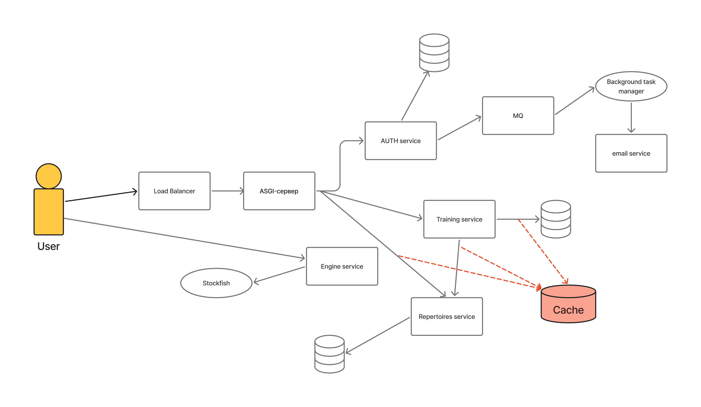

[← README](../README.md)

# High-Level Design

## 1. Overview

Краткое описание технической реализации системы.

## 2. API Gateway

### Responsibilities

- `auth` - выдача токенов, регистрация, вход, смена пароля и почты, связь с рассылкой почты
- `repertoire` - база дебютов, кастомные репертуары пользователя
- `training` - тренировка + возможно в будущем аналитика
- `engine` - оценка позиции и расчет лучших ходов, стриминг текущей оценки позиции.
