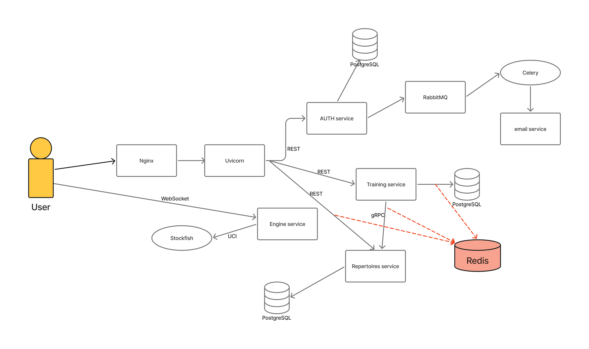

[Вернуться к README.md](../README.md)

# Low-Level Design

## 1. Overview

Краткое описание технической реализации системы.

## 2. API Gateway

### Stack Decisions

- [ADR-0001 — Microservices Architecture](adr/0001-microservices.md)
- [ADR-0002 — FastAPI](adr/0002-fastapi.md)
- [ADR-0003 — JWT Authentication](adr/0003-jwt.md)
- [ADR-0004 — gRPC](adr/0004-grpc.md)
- [ADR-0005 — WebSockets](adr/0005-websockets.md)
- [ADR-0006 — Redis](adr/0006-redis.md)
- [ADR-0007 — RabbitMQ](adr/0007-rabbitmq.md)
- [ADR-0008 — Celery](adr/0008-celery.md)
